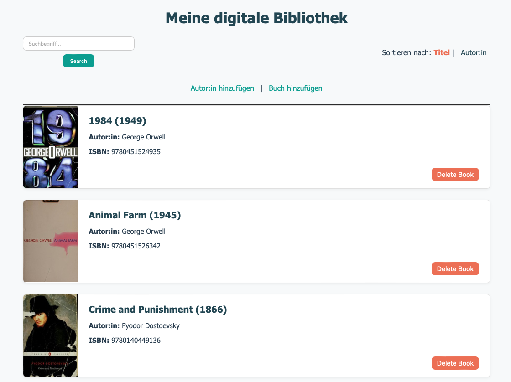

# Book Alchemy

Book Alchemy is a simple digital library web application built with Flask and SQLAlchemy. It allows you to manage authors and books, search by keyword, sort entries, and remove books (and orphaned authors) when you no longer need them. The frontend uses a responsive, mobile-friendly design with a modern CSS theme.

## Features

* **Add Authors**
  Create new author records with name, birth date, and optional date of death.

* **Add Books**
  Create new book records with title, ISBN, publication year, and select an existing author from a dropdown.

* **Home Page**

  * List all books (cover image, title, publication year, author name, ISBN).
  * Sort by book title or author name.
  * Keyword search on book titles.
  * Delete a book (and automatically remove its author if they have no remaining books).

* **Responsive UI**
  A modern, mobile-friendly design using a single CSS file in the `/static` folder.

* **Database Seeding Script**
  A one-time script (`seed_data.py`) to populate the database with five authors and twenty books.

## Screenshot



> *Example of the home page displaying books with covers, search bar, sorting links, and delete buttons.*

## Tech Stack

* **Flask** – lightweight web framework
* **Flask-SQLAlchemy** – ORM for interacting with SQLite
* **SQLite** – file-based relational database
* **HTML / Jinja2** – template engine for dynamic pages
* **CSS** – responsive styling via a single `style.css` in `/static`

## Requirements

* Python 3.9 or higher
* Git (to clone the repository)

All Python dependencies are listed in `requirements.txt`.

## Installation

1. **Clone the repository**

   ```bash
   git clone git@github.com:RomKow/Book_Alchemy.git  
   cd Book_Alchemy  
   ```

2. **Create and activate a virtual environment**

   ```bash
   python3 -m venv .venv  
   source .venv/bin/activate   # On Windows: .venv\Scripts\activate  
   ```

3. **Install dependencies**

   ```bash
   pip install --upgrade pip  
   pip install -r requirements.txt  
   ```

4. **Create the database**
   This step initializes the SQLite database file (`data/library.sqlite`) and creates the necessary tables.

   ```bash
   python create_db.py  
   ```

5. **(Optional) Seed initial data**
   To populate the database with 5 authors and 20 books, run:

   ```bash
   python seed_data.py  
   ```

6. **Run the application**

   ```bash
   python app.py  
   ```

   By default, Flask will start in debug mode and serve on `http://127.0.0.1:5000/`.

## Usage

* **Home Page** (`/`)

  * Browse all books with cover images (fetched via OpenLibrary’s Cover API).
  * Use the search bar to filter books by title keyword (case-insensitive).
  * Click “Sort by Title” or “Sort by Author” to reorder the list.
  * Click “Delete Book” on any card to remove that book. If its author has no other books, the author record will be deleted as well.

* **Add Author** (`/add_author`)

  * Fill in “Name” and “Birthdate” (required).
  * “Date of Death” is optional.
  * Submit to save a new author and receive a success message.

* **Add Book** (`/add_book`)

  * Only available if at least one author exists.
  * Fill in “Title”, “ISBN” (must be unique), “Publication Year”, and choose an author from the dropdown.
  * Submit to save a new book and receive a success message.

### Routes Summary

| Route                        | Methods   | Description                                                |
| ---------------------------- | --------- | ---------------------------------------------------------- |
| `/`                          | GET       | Home page with book listing, search, sorting, and delete.  |
| `/add_author`                | GET, POST | Display form to add an author; on POST, create new author. |
| `/add_book`                  | GET, POST | Display form to add a book; on POST, create new book.      |
| `/book/<int:book_id>/delete` | POST      | Delete a specific book; also delete author if orphaned.    |

## Project Structure

```
Book_Alchemy/
├── app.py
├── create_db.py
├── data_models.py
├── seed_data.py
├── requirements.txt
├── README.md
├── .gitignore
├── data/
│   └── library.sqlite          # SQLite database (generated after create_db.py)
├── static/
│   └── style.css               # Main CSS for responsive design
└── templates/
    ├── home.html
    ├── add_author.html
    └── add_book.html
```

* **`app.py`**
  Main Flask application: routes, flash messages, database initialization.

* **`data_models.py`**
  SQLAlchemy models for `Author` and `Book`, with relationships and string representations.

* **`create_db.py`**
  One-time script to create all database tables.

* **`seed_data.py`**
  One-time script to insert 5 authors and 20 books into the database.

* **`requirements.txt`**
  Lists Python dependencies: Flask, Flask-SQLAlchemy, SQLAlchemy.

* **`static/style.css`**
  Modern, responsive CSS file used by all templates.

* **`templates/`**
  Jinja2 templates for home page, add author form, and add book form.

* **`.gitignore`**
  Specifies files/folders to ignore in Git (e.g., `.venv/`, `data/library.sqlite`, editor settings).

## Contributing

1. Fork the repository.
2. Create a new branch:

   ```bash
   git checkout -b feature/my-new-feature  
   ```
3. Make your changes and commit them:

   ```bash
   git commit -m "Add my new feature"  
   ```
4. Push to your fork:

   ```bash
   git push origin feature/my-new-feature  
   ```
5. Open a Pull Request against `main`.

## License

This project is provided under the MIT License. See the [LICENSE](LICENSE) file for details.
